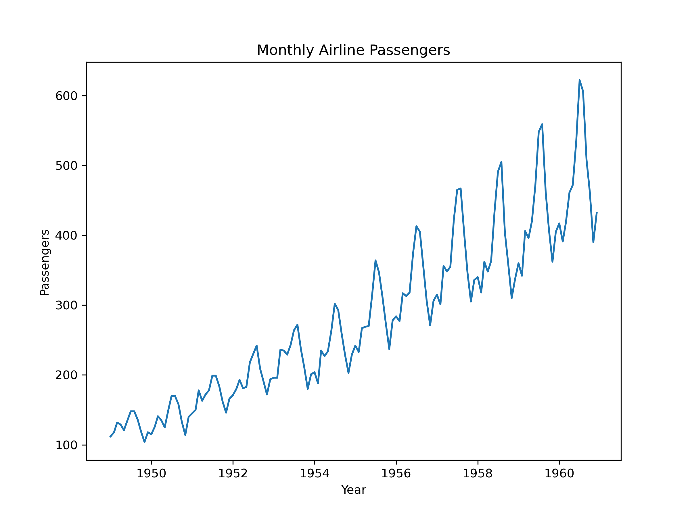

# Time Series Forecasting — AirPassengers Dataset

## 📌 Project Overview
This project forecasts **monthly airline passenger numbers** (1949–1960) using ARIMA and Prophet models.  
It follows a **full MLDC workflow**:  data preparation, modeling, evaluation

---

## 🎯 Objective
Forecast the next 12 months of passenger traffic to help airlines with:
- Capacity planning  
- Revenue optimization  
- Seasonal demand management  

---

## 🛠 Tools & Libraries
- Python  
- Pandas & Numpy  
- Matplotlib & Seaborn  
- Statsmodels (ARIMA, Decomposition)  
- Prophet (Forecasting)  
- Scikit-learn (Metrics, Cross-validation)

---

## 📊 Exploratory Data Analysis (EDA)

**Monthly Passenger Trend:**

**Seasonality & Trend Decomposition:**

---

## 🔍 Modeling & Forecasting

- **ARIMA Model:** Captures trend and seasonality with differencing  
- **Prophet Model:** Handles yearly seasonality & changepoints  
- **Cross-Validation:** Validates Prophet model using TimeSeriesSplit  
- **Hyperparameter Tuning:** Adjusted `changepoint_prior_scale` for best accuracy  

**Final 12-Month Forecast:**

---

## 📈 Model Performance

| Model      | Accuracy (%)     | RMSE      |
|------------|------------------| ----------|   
| ARIMA      | 91.77950883232468|  27.308691|
| Prophet    | 95.31029077803356| 55.222839 |
| Cross-Validated Prophet |90.15333140458574|

**Evaluation Metrics:**  
- Root Mean Squared Error (RMSE)

---

## 📁 Folder Structure

time-series-forecasting-air-passengers/
│
├── data/
│   └── airline-passengers.csv       # Raw dataset
│
├── notebooks/
│   ├── EDA.ipynb                  # EDA + Stationarity + Decomposition
│   └── Modeling_Forecasting.ipynb # ARIMA + Prophet + Cross-validation + Hyperparameter tuning + Final Forecast
│
├── src/
│   └── forecasting.py               # Optional reusable functions for modeling
│
├── images/
│   ├── time_series_plot.png         # Monthly passenger trend
│   ├── decomposition_plot.png       # Trend + seasonality decomposition
│   └── prophet_forecast.png         # Forecast for next 12 months
│   └── prophet_test_comparison.png  #Train vs Test vs Forecast  
├── requirements.txt                 # Dependencies

└── README.md                        # Full project explanation

